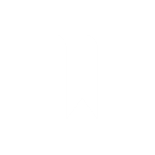
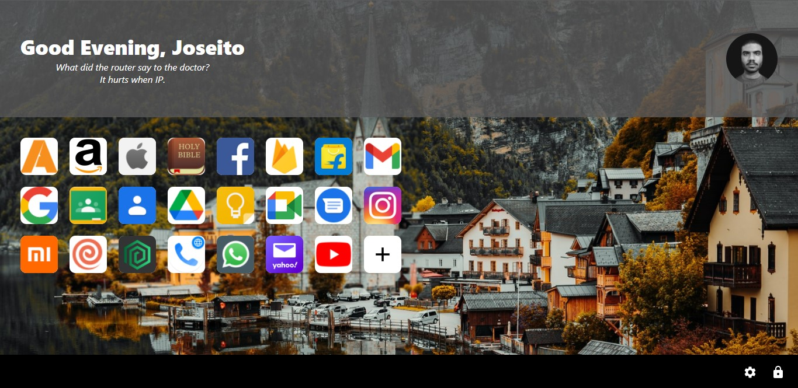
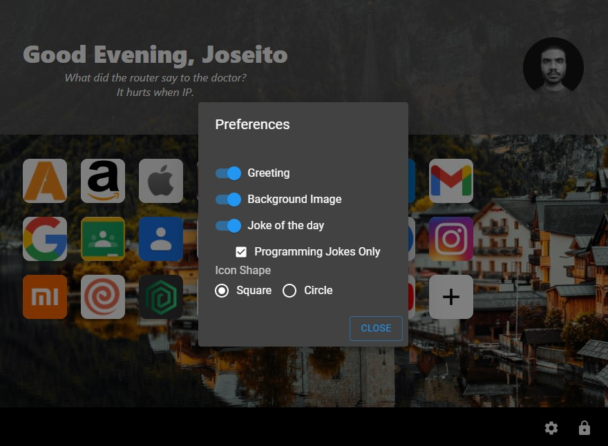

<p align="center">
    

  <h2 align="center">Quick Access</h2>

  <p align="center">
    "Store once, access anywhere."
    <br />
    Developed By: <strong>Joseito Fernandes</strong>
    <br />
    <br />
    <a href="https://quick-access-6293a.web.app/">
      <h2 align="center">View Demo</h2>
    </a>

  </p>
</p>
<br>

## About The Project
Quick access is a web app created using ReactJS. It is a app to store bookmarks/favourite sites in one place and access from anywhere. It is also a great application to be a browser's homepage.






### Built With

Following are the major frameworks and libraries used to build this project.
* [ReactJS](https://reactjs.org/)
* [Material-UI](https://material-ui.com/)
* [Firebase](https://firebase.google.com/) (Firestore, Authentication and Hosting)

Following are some of the other APIs used in this project.
* [Unsplash API](https://unsplash.com/developers) (For Background Images)
* [Favicon Kit](https://faviconkit.com/) (To get icon for any link)
* [official_joke_api](https://github.com/15Dkatz/official_joke_api)
* [Fetch API](https://developer.mozilla.org/en-US/docs/Web/API/Fetch_API)

## Getting Started

To get a local copy up and running follow these simple example steps.

### Installation

1. Clone the repo
   ```sh
   git clone https://github.com/joseito-terence/quick-access.git
   ```
2. Install NPM packages
   ```sh
   npm install
   ```
3. Start NPM server.
   ```sh
   npm start
   ```
